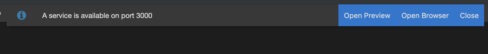
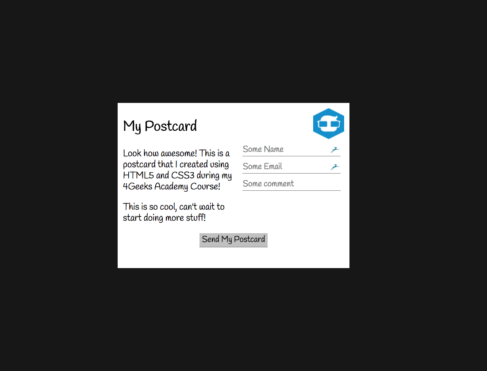

# My-Postcard
  Created a basic digital postcard with input fields.

## Deployment Instructions (How to Open Project Live)
  This project was originally developed on and run through GitPod. If you'd like to view the page live in a browser, run "python3 -m http.server 3000" in the command terminal. Once entered, Gitpod will give you options to view the project; click "Open Browser". A new tab should open up displaying the page. 

## Build / Layout
  "My-Postcard" was developed for a programming course project, using only HTML and CSS,.

  The following image is the example I was supposed to model my work after (the minimum desired result):
  

## Final Product
